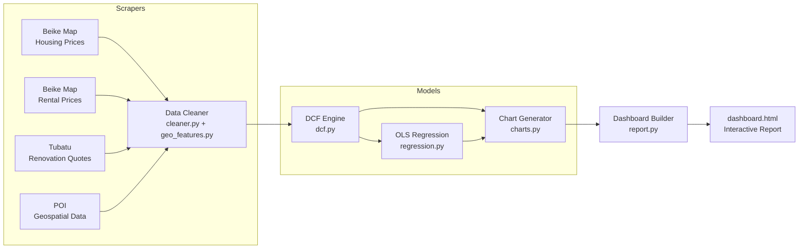
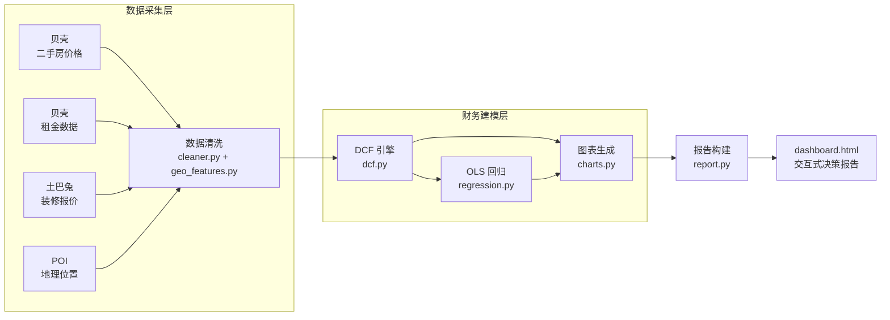

[English](#english-version) | [中文版本](#中文版本)

---

## English Version

# Guangzhou Residential Real Estate Investment Analysis Prototype

**Quantitative Analysis of Housing Prices, Rental Yields & DCF Valuation**


---

### Background

Using a representative residential property in Haizhu District, Guangzhou as a case study, this paper compares asset management strategies such as whole-unit rental, short-term rental, subletting, and sale. To avoid making decisions based on intuition, a complete data-driven system was built from scratch: covering the entire process from crawling real market data to financial modeling to quantify the returns of each option, and finally generating interactive decision reports.

---

### Key Features

1. **Async Multi-Source Scraper** — Playwright-based async scrapers for Beike (贝壳) housing price maps, rental listings, and Tubatu (土巴兔) renovation cost estimates; manages browser sessions, login flows, and anti-bot headers across concurrent contexts.

2. **Geospatial Data Enrichment** — Filters listings using a precise Haizhu District bounding box to remove mis-tagged locations; extracts POI proximity features (subway stations, commercial districts) for regression analysis.

3. **Three-Scenario DCF Financial Model** — For each rental strategy, computes annual NOI with occupancy and operating expense adjustments, deducts mortgage payments (30-year amortization), applies a terminal cap rate of 4%, and solves IRR via Newton-Raphson iteration. Outputs IRR, NPV, and annual cash flow series.

4. **OLS Regression Analysis** — Fits unit price vs. floor area and rent-to-sale ratio models to quantify market-level relationships and identify pricing patterns.

5. **Interactive Decision Dashboard** — A self-contained single HTML file with 10 Plotly/Matplotlib charts, KPI summary cards, and an embedded JavaScript property calculator — no server required; opens directly in a browser.

---

### Architecture

#### Pipeline Overview



#### Module Responsibilities

| Module | File | Responsibility |
|--------|------|----------------|
| Scrapers | `scrapers/` | Async Playwright scrapers; handle login, pagination, anti-bot headers |
| Cleaner | `processing/cleaner.py` | Removes outliers, normalizes units, computes rent-to-sale ratio |
| Geo Features | `processing/geo_features.py` | Haizhu bbox filtering, POI distance features, per-community IRR |
| DCF Engine | `models/dcf.py` | Mortgage amortization → annual NOI → terminal value → IRR (Newton-Raphson) → NPV |
| Regression | `models/regression.py` | OLS on unit price vs. area and rent-to-sale ratio |
| Charts | `visualization/charts.py` | 10 charts: distributions, DCF cash flows, NPV/IRR subplots, regression fit |
| Dashboard | `visualization/report.py` | Assembles KPI cards, chart embeds, and JS calculator into single HTML |

#### Key Design Decisions

- **Full async scraping** — all scrapers run under `asyncio`, parallelizing browser sessions to minimize collection time
- **Decoupled financial models** — DCF and regression are pure-NumPy/statsmodels functions with no visualization dependencies, enabling isolated testing and reuse
- **Self-contained dashboard** — the output is a single HTML file with no external dependencies; anyone can open it in a browser without installing anything
- **Bounded IRR solver** — Newton-Raphson is constrained to [-90%, 2000%] to gracefully handle edge cases where cash flows are irregular

---

### Tech Stack

| Category | Tools |
|----------|-------|
| Web Scraping | Playwright (async), custom browser engine, anti-bot headers |
| Data Processing | Pandas, NumPy, GeoPandas |
| Financial Modeling | DCF, IRR (Newton-Raphson), NPV, amortization |
| Statistical Analysis | OLS Regression (statsmodels) |
| Visualization | Matplotlib, Plotly (interactive HTML), HTML/CSS/JS |

---

### Project Structure

```
├── files/
│   ├── main.py                   # Pipeline entry point — orchestrates all stages
│   ├── scrapers/
│   │   ├── beike_map_scraper.py  # Housing price map scraper
│   │   ├── beike_rent_scraper.py # Rental listing scraper
│   │   ├── tubatu_scraper.py     # Renovation cost scraper
│   │   ├── poi_scraper.py        # POI geospatial scraper
│   │   └── browser_engine.py     # Shared Playwright session management
│   ├── processing/
│   │   ├── cleaner.py            # Data cleaning and rent-to-sale ratio
│   │   └── geo_features.py       # Geographic feature engineering
│   ├── models/
│   │   ├── dcf.py                # DCF + IRR + NPV engine
│   │   └── regression.py         # OLS regression analysis
│   ├── visualization/
│   │   ├── charts.py             # Chart generation (Plotly + Matplotlib)
│   │   └── report.py             # Dashboard HTML builder
│   └── build_dashboard.py        # Standalone dashboard refresh (no re-scrape)
└── output/
    ├── dashboard.html            # Main output — interactive investment report
    ├── summary.json              # Machine-readable KPI summary
    └── charts/                   # Individual chart files (HTML + PNG)
```

---

### Quick Start

```bash
# Install dependencies
pip install pandas numpy matplotlib plotly playwright statsmodels
playwright install chromium

# Full pipeline: scrape → clean → model → visualize
python3 files/main.py

# Refresh dashboard only (when data is already collected)
python3 files/build_dashboard.py output
```

> **Note:** `main.py` requires a Beike (贝壳) account and will open a browser for login on first run.

---

### Sample Results

Based on **53 property listings** in Haizhu District, Guangzhou (May 2026):

| Metric | Value |
|--------|-------|
| Sample size | 53 listings |
| Avg. unit price | 34,100 CNY/㎡ |
| Avg. monthly rent | 83.3 CNY/㎡ |
| Gross rental yield | 2.93% |
| Rent-to-sale ratio | 1:409 |
| Best IRR — with mortgage | **4.56%** (短租/民宿 mode) |
| Best IRR — mortgage-free | **2.84%** (短租/民宿 mode) |
| Best annual NOI — already owned | **66,100 CNY** (隔断分租 mode) |

---

### Data Sources & Disclaimer

Data scraped from **Beike (贝壳找房)** housing price map and rental listings, and **Tubatu (土巴兔)** renovation cost database. Collected May 2026, Haizhu District, Guangzhou. For personal research and decision-making purposes only. Not investment advice.

---

---

## 中文版本

# 广州海珠区住宅资产管理策略分析原型

**基于真实市场数据的端到端数据采集、财务建模与可视化决策项目**


---

### 项目背景

以广州市海珠区一套代表性住宅为案例，比较整租、短租、分租与出售的资产管理策略。为避免凭直觉决策，从零搭建了这套完整的数据驱动系统：从爬取真实市场数据，到财务建模量化各方案回报，再到生成可交互决策报告，全流程覆盖。

---

### 核心功能

1. **异步多源爬虫** — 基于 Playwright 的异步爬虫，采集贝壳找房二手房价格地图、租金挂牌数据及土巴兔装修报价；处理登录流程、分页翻页和反爬虫请求头，多浏览器会话并发执行。

2. **地理增强数据处理** — 基于海珠区精确边界框（bbox）过滤地址异常房源；提取 POI 地理特征（地铁站距离、商圈覆盖情况），用于回归分析中的影响因子量化。

3. **三场景 DCF 财务建模** — 针对整租、民宿、隔断分租三种模式，逐年计算 NOI（含出租率、运营费率、租金增长），扣除等额还款月供，按 4% 终值资本化率计算退出价值，使用 Newton-Raphson 迭代求解 IRR，输出 IRR、NPV 及逐年现金流。

4. **OLS 回归分析** — 对单价 vs. 面积、租售比进行线性回归建模，量化市场层面的定价规律与影响因子。

5. **交互式决策 Dashboard** — 单个独立 HTML 文件，包含 10 张 Plotly/Matplotlib 图表、KPI 摘要卡片，以及嵌入式 JavaScript 房产投资计算器（纯前端，无需服务器，浏览器直接打开）。

---

### 系统架构

#### 数据处理流程



#### 模块职责

| 模块 | 文件 | 职责 |
|------|------|------|
| 爬虫层 | `scrapers/` | 异步 Playwright 爬虫；处理登录、分页、反爬虫请求头 |
| 数据清洗 | `processing/cleaner.py` | 去除异常值、单位标准化、计算租售比 |
| 地理特征 | `processing/geo_features.py` | 海珠区 bbox 过滤、POI 距离特征提取、社区级 IRR 计算 |
| DCF 引擎 | `models/dcf.py` | 月供计算 → 年 NOI → 终值 → IRR（Newton-Raphson） → NPV |
| 回归分析 | `models/regression.py` | 单价 vs. 面积、租售比 OLS 回归建模 |
| 图表生成 | `visualization/charts.py` | 10 张图表：分布图、DCF 现金流、NPV/IRR 对比、回归拟合 |
| 报告构建 | `visualization/report.py` | 将 KPI 卡片、图表嵌入、JS 计算器组装为单页 HTML |

#### 关键设计决策

- **全异步爬取** — 爬虫层基于 `asyncio`，多浏览器会话并行运行，减少数据采集等待时间
- **财务模型与可视化解耦** — DCF 和回归模型为纯 NumPy/statsmodels 函数，无可视化依赖，便于独立测试和复用
- **单文件独立 Dashboard** — 输出为单个 HTML 文件，无外部依赖，任何人打开浏览器即可查看，无需安装任何环境
- **有界 IRR 求解器** — Newton-Raphson 设定 [-90%, 2000%] 边界，优雅处理现金流异常的极端情况

---

### 技术栈

| 类别 | 工具 |
|------|------|
| 网络爬虫 | Playwright（异步）、自定义浏览器引擎、反爬虫请求头 |
| 数据处理 | Pandas、NumPy、GeoPandas |
| 财务建模 | DCF 现金流折现、IRR（Newton-Raphson）、NPV、等额还款 |
| 统计分析 | OLS 回归（statsmodels） |
| 数据可视化 | Matplotlib、Plotly（交互式 HTML）、HTML/CSS/JS |

---

### 项目结构

```
├── files/
│   ├── main.py                   # 主流程入口 — 统筹各阶段执行
│   ├── scrapers/
│   │   ├── beike_map_scraper.py  # 贝壳二手房价格地图爬虫
│   │   ├── beike_rent_scraper.py # 贝壳租金挂牌爬虫
│   │   ├── tubatu_scraper.py     # 土巴兔装修报价爬虫
│   │   ├── poi_scraper.py        # POI 地理数据爬虫
│   │   └── browser_engine.py     # Playwright 会话管理（共享）
│   ├── processing/
│   │   ├── cleaner.py            # 数据清洗与租售比计算
│   │   └── geo_features.py       # 地理特征工程
│   ├── models/
│   │   ├── dcf.py                # DCF + IRR + NPV 引擎
│   │   └── regression.py         # OLS 回归分析
│   ├── visualization/
│   │   ├── charts.py             # 图表生成（Plotly + Matplotlib）
│   │   └── report.py             # Dashboard HTML 构建器
│   └── build_dashboard.py        # 独立刷新报告（无需重新爬取）
└── output/
    ├── dashboard.html            # 主输出 — 交互式投资决策报告
    ├── summary.json              # KPI 指标摘要（机器可读）
    └── charts/                   # 各图表文件（HTML + PNG）
```

---

### 快速开始

```bash
# 安装依赖
pip install pandas numpy matplotlib plotly playwright statsmodels
playwright install chromium

# 完整流程：爬取 → 清洗 → 建模 → 生成报告
python3 files/main.py

# 仅刷新 Dashboard（已有采集数据时）
python3 files/build_dashboard.py output
```

> **提示：** `main.py` 需要贝壳账号，首次运行会自动打开浏览器进行登录。

---

### 分析结果示例

基于广州市海珠区 **53 套** 房源数据（采集时间：2026 年 5 月）：

| 指标 | 数值 |
|------|------|
| 样本量 | 53 套 |
| 平均单价 | 3.41 万元/㎡ |
| 平均月租金 | 83.3 元/㎡ |
| 年化租金收益率 | 2.93% |
| 租售比 | 1:409 |
| 最优 IRR（有贷款） | **4.56%**（民宿模式） |
| 最优 IRR（无贷款/已还清） | **2.84%**（民宿模式） |
| 最优年 NOI（已持有） | **6.61 万元**（隔断分租模式） |

---

### 数据说明

数据来源于**贝壳找房**（二手房成交价格地图 + 租房挂牌）及**土巴兔**装修报价平台，采集时间 2026 年 5 月，范围限定广州市海珠区。仅供个人研究与决策参考，不构成投资建议。
